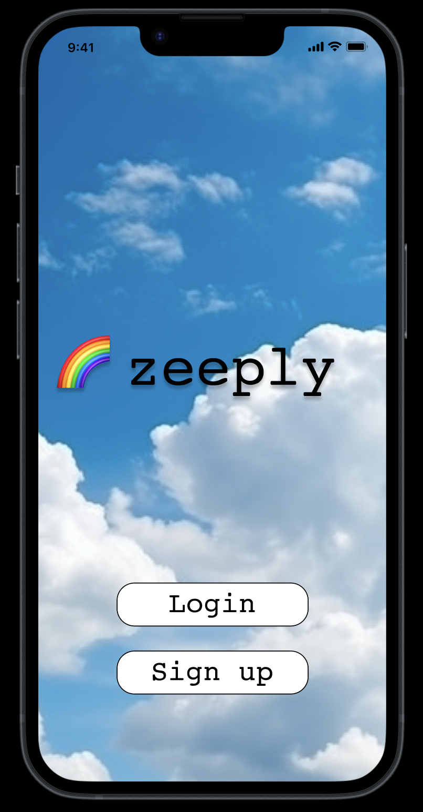

# 🌈 Zeeply - Skill-Sharing App

Welcome to Zeeply, a skill-sharing app that allows users to post blogs, videos, and audio about their niche areas of expertise. Zeeply aims to provide a platform where individuals can share their knowledge and help others acquire skillsets that may be difficult to research independently. This README will guide you through the features, technical requirements, and tools used in building Zeeply.

## Features

1. User Management:
   - Sign up: Users can create a new account on Zeeply.
   - Login: Registered users can log in to their accounts.
   - Follow/Unfollow Users: Users can follow or unfollow other users to stay updated with their posts.
   - Logout: Users can securely log out of their accounts.
   - Home Feed: Users can view a personalized home feed displaying posts from users they follow.

2. Profile Management:
   - Create a Profile: Users can create their profiles by providing relevant information.
   - Update a Profile: Users can edit and update their profile information.
   - View Posts on Profile: Users can see the posts they have created on their profile page.
   - Reviews on Profile: Reviews received by users will be displayed on their profile.
   - Bio: Users can add a biography to their profile to introduce themselves to the community.

3. Skill Management:
   - Create, Update, and Delete Skills: Users can create, edit, and delete their skills.
   - Add Skills to Posts: Users can associate relevant skills with their posts to provide context.
   - Skill Repository: A centralized repository where users can add skills to a post.
   - Filter Skills: Users can filter posts based on specific skills to find content of interest.

4. Post Management:
   - Create a Post: Users can create new posts, including blogs.
   - Update a Post: Users can edit and update their existing posts.
   - Delete a Post: Users have the option to delete their own posts.
   - Communal Home Feed: A shared feed where posts from various users are displayed.
   - Save Posts: Users can save posts created by others for future reference.
   - Search for Posts: Users can search for specific posts using keywords or filters.
   - Media Integration: Posts can include media content (e.g., images, videos) uploaded via AWS.

## Technical Requirements

To meet the technical requirements of Zeeply, the following specifications have been implemented:

- Full-Stack Django Application: Zeeply is built using the Django framework, enabling both the front-end and back-end development within a single codebase.
- Database: Zeeply persists data using PostgreSQL, a robust and scalable relational database management system.
- User Authentication: Zeeply employs Django's built-in authentication system to securely manage user registration, login, and session management.
- Authorization: Zeeply restricts access to certain actions such as creating, updating, and deleting resources based on user roles and permissions.
- Deployment: Zeeply is deployed online using Heroku, a cloud platform that provides hosting services for web applications.

## Technical Tools Leveraged

Zeeply was developed utilizing the following tools:

- Django: The primary web framework used for building the application's back-end and handling the server-side logic.
- CSS and HTML: Used for styling and structuring the user interface.
- PostgreSQL: A robust and reliable relational database management system for persisting data.
- AWS: Integrated to facilitate media storage and retrieval for posts.
- GitHub: Utilized as a version control system to collaborate and manage the codebase among the team of 3 developers. Git workflows, commits, and syncing were implemented using GitHub.

## Product and Project Management Tools Leveraged
- Figma: A design tool used to create visual mockups and wireframes of the application.
- Notion: Employed for product management purposes, including project planning, documentation
- Heroku: A cloud platform used to deploy the Zeeply app
- Miro: Used for product management, visual collaboration, and brainstorming.

## Getting Started

To get started with Zeeply, follow these steps:

Access Zeeply in your web browser at: 

## Future Enhancements

We have some exciting plans for future enhancements of Zeeply, including:

1. Adding a messaging feature to facilitate direct communication between users.
2. Implementing a rating system for users and posts to enhance the credibility of the content.
3. Introducing a notification system to keep users informed about new posts, comments, and interactions.
4. Expanding the skill repository to include a wider range of skills and categories.
5. Improving the search functionality to provide more accurate and relevant results.

## Screenshots

Login & Signup page

## Credits

Zeeply is made possible thanks to the contributions of the following individuals:

- Eli Lonner: Full-stack Development, Database & GitHub Management
- Sydney Morrison: Full-stack Development, CSS & HTML, Designer, Product Management
- Andrew Galicia: Full-stack Development, CSS & HTML, Scrum Manager
